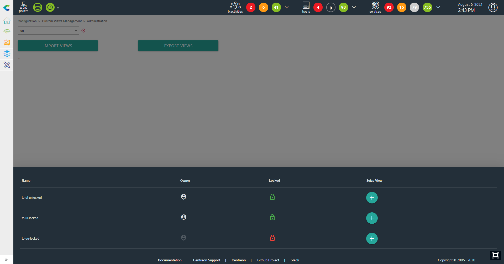
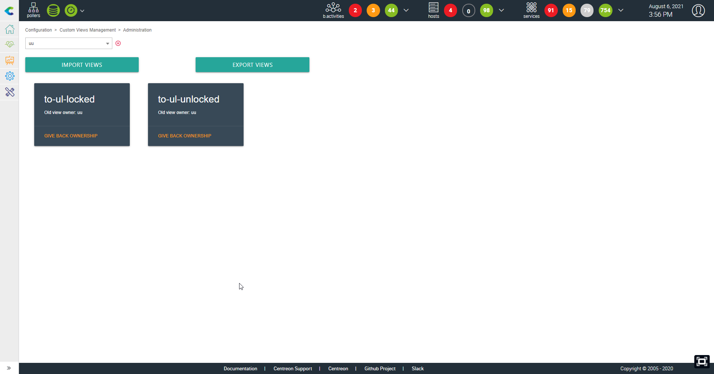
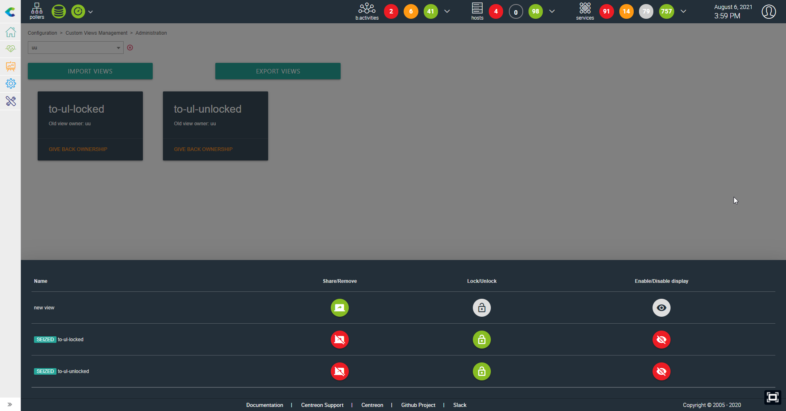

# centreon-custom-views-management

## Introduction

This community module allows you to administrate custom views for you users. You must use an administrator account in Centreon to use it.

## What it does

- Take control of a custom view that is shared to a user. The user doesn't need to be owner of the said custom view. The custom view doesn't need to be consumed by the user.
- Give back control of a custom view to the user that was the owner before you seized it.
- Share one of your custom views to another user (this include your custom views and the one you've take control of).
- Sharing a custom view gives you the possibility to set it as locked/unlocked and force its consumption to the user

## What it doesn't

- Sharing options are limited to users, you can't share to user groups. (may come in a later release)
- Will not bring an additional olympic gold medal to your favorite country

## Screenshots

### Import custom views from a user

### List of imported custom views

### Custom views sharing options

